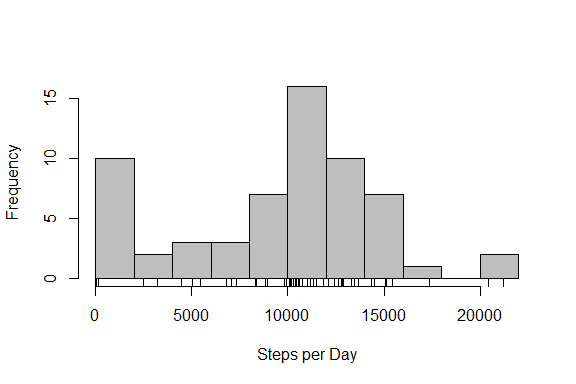
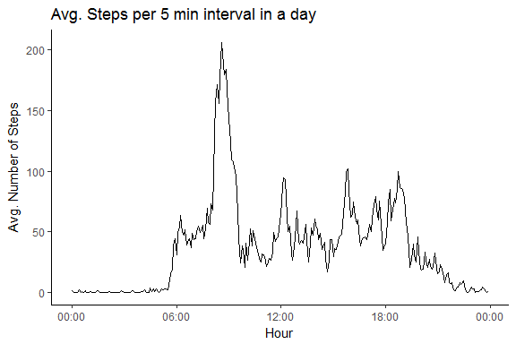
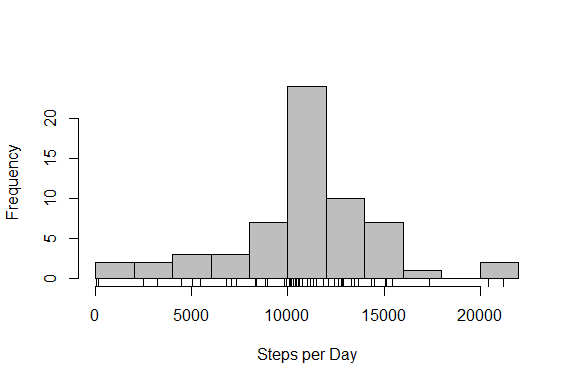
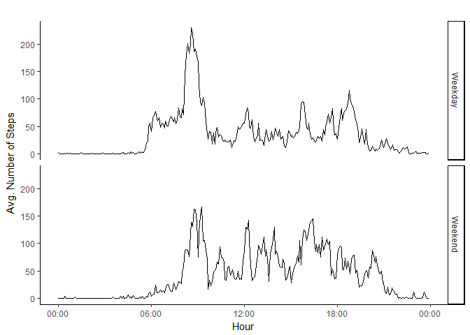

# Reproducible Research: Peer Assessment 1


## Loading and preprocessing the data


```r
library(readr, warn.conflicts = FALSE, quietly = TRUE)
```

```
## Warning: package 'readr' was built under R version 3.3.3
```

```r
library(dplyr,  warn.conflicts = FALSE, quietly = TRUE)
```

```
## Warning: package 'dplyr' was built under R version 3.3.3
```

```r
library(ggplot2, warn.conflicts = FALSE, quietly = TRUE)
```

```
## Warning: package 'ggplot2' was built under R version 3.3.3
```

```r
unzip("activity.zip", files = "activity.csv")
activity<-read_csv("activity.csv", col_types = cols(steps = col_integer(),
                                                    date = col_date(format = ""),
                                                    interval = col_integer()))
##activity$interval<-format(strptime(sprintf("%04d",activity$interval), format="%H%M"), format="%H:%M")
##activity$interval<-as.POSIXct(paste(activity$date, sprintf("%04.0f", activity$interval)), ##format='%Y-%m-%d %H%M')
```

## What is mean total number of steps taken per day?

```r
daysteps<-group_by(activity, date) %>% summarize(steps.per.day=sum(steps, na.rm=T))
with(daysteps, hist(steps.per.day, breaks = 10, col="gray", xlab="Steps per Day", main=""))
rug(daysteps$steps.per.day)
```

<!-- -->

```r
summary(daysteps$steps.per.day, digits = 10)
```

```
##     Min.  1st Qu.   Median     Mean  3rd Qu.     Max. 
##     0.00  6778.00 10395.00  9354.23 12811.00 21194.00
```


## What is the average daily activity pattern?


```r
daily<-group_by(activity, interval) %>% summarize(avg.steps=mean(steps, na.rm=TRUE))
theme_set(theme_classic())
t<-ggplot(daily, aes(x=as.POSIXct(sprintf("%04.0f", daily$interval), format="%H%M"), y=avg.steps))
t+geom_line() + labs(title="Avg. Steps per 5 min interval in a day", 
                     y="Avg. Number of Steps", 
                     x="")+ scale_x_datetime("Hour", date_labels = "%H:%M")
```

<!-- -->

```r
dailymax<-daily[which.max(daily$avg.steps),]
maxhour<-format(strptime(sprintf("%04d", dailymax$interval), format="%H%M"),
                format="%H:%M")
maxsteps<-round(dailymax$avg.steps)
```


The 5-min interval with the maximum number of steps is at 08:35 with 206 steps.

## Imputing missing values

```r
stepsNA<-is.na(activity$steps)
```

There are 2304 missing values, equivalent to 13% of all records;


```r
activity2<-activity %>% 
    group_by(interval) %>% 
    mutate(steps= ifelse(is.na(steps), round(mean(steps, na.rm=T)), steps)) %>%
    ungroup()

daysteps2<-group_by(activity2, date) %>% summarize(steps.per.day=sum(steps, na.rm=T))
with(daysteps2, hist(steps.per.day, breaks = 10, col="gray", xlab="Steps per Day", main=""))
rug(daysteps2$steps.per.day)
```

<!-- -->

```r
summary(daysteps2$steps.per.day, digits = 10)
```

```
##     Min.  1st Qu.   Median     Mean  3rd Qu.     Max. 
##    41.00  9819.00 10762.00 10765.64 12811.00 21194.00
```

The average number of steps per day changed from 9354 to 
10766

## Are there differences in activity patterns between weekdays and weekends?


```r
activity2<-mutate(activity2, weekday=ifelse(weekdays(date) %in% c("Saturday", "Sunday"), "Weekend", "Weekday"))
activity2$weekday<-as.factor(activity2$weekday)
daily2<-group_by(activity2, interval, weekday) %>% summarize(avg.steps=mean(steps, na.rm=TRUE))

t<-ggplot(daily2, aes(x=as.POSIXct(sprintf("%04.0f", interval), format="%H%M"), y=avg.steps))
t+geom_line() + facet_grid(weekday ~ .)+
    labs(title="", 
                     y="Avg. Number of Steps", 
                     x="")+ scale_x_datetime("Hour", date_labels = "%H:%M")
```

<!-- -->
